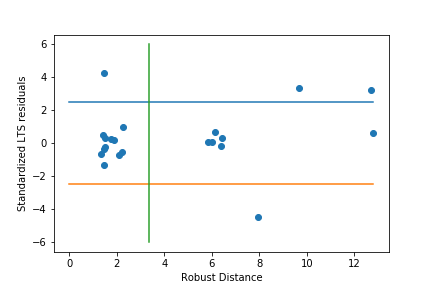

# Reweighted-FastLTS

The Reweighted-FastLTS is a robust regression algorithm that allows you to detect anomalous observations.
A Python <a href="https://pypi.org/project/ltsfit/" target="_blank">implementation of FastLTS</a> (by Michele Cappellari) is based on the analysis of datasets with 3 predictors <i>(p)</i>. Inspired by the work of Cappellari and the research of <a href="https://scholar.google.com/citations?hl=it&user=5LMM6rsAAAAJ" >Prof. Peter Rousseeuw</a> I implemented a python version of the Reweighted-FastLTS for (i) <i>p</i> predictors with <i>p < n</i> (n number of observations) (ii) <i>n < 600</i>.
  
The attributes of Reweighted-FastLTS python class are the same that would be obtained by invoking the <a href="https://www.rdocumentation.org/packages/robustbase/versions/0.93-5/topics/ltsReg" target="_blank">ltsReg</a> in RStudio.
Some doubts are about the implementation of FastMCD. In particular, I used <a href="https://scikit-learn.org/stable/modules/generated/sklearn.covariance.MinCovDet.html">MinCovDet<a> from the sklearn library, and I realized that the location and the covariance matrix are different from those obtained by RStudio, with the consequence that the Robust Distance is different.
    
  <h3>- Reference</h3>
  <ul>
    <li><a href="https://www.researchgate.net/publication/220451824_Computing_LTS_Regression_for_Large_Data_Sets">Fast-LTS<a></li>
    <li><a href="https://onlinelibrary.wiley.com/doi/abs/10.1002/widm.1236">Anomaly detection by robust statistics<a></li>
  </ul>
  <h3>- Some examples</h3>
  Below I report the results of some tests. In particular, in the left column you will see the results obtained with Reweighted-FastLTS,   while in the right column you will see the results obtained with ltsReg of RStudio's <i>robustbase</i> library. The datasets used are   <a href="https://www.rdocumentation.org/packages/robustbase/versions/0.93-5/topics/hbk">Hawkins-Bradu-Kass data(HBK)</a> and    <a href="https://www.rdocumentation.org/packages/datasets/versions/3.6.2/topics/stackloss"> Stackloss data </a>.
   
  
    <h4>-- Hawkins-Bradu-Kass</h4>
      <table>
        <tr><td></td><td><b>Reweighted-FastLTS</b></td><td><b>ltsReg</b></td></tr>
        <tr><td></td><td></td><td></td></tr>
        <tr><td>alpha</td><td>0.5</td><td>0.5</td></tr>
        <tr><td>quan</td><td>40</td><td>40</td></tr>
        <tr><td>raw_coefficents</td><td>[ 0.27835867, 0.04327558, -0.10558377] </td><td>[0.27835868, 0.04327561, -0.10558381]</td></tr>
        <tr><td>raw_intercept</td><td>-0.62325114 </td><td>-0.6232511</td></tr>
        <tr><td>raw_scale</td><td> 0.8535975675079938</td><td> 0.8543587</td></tr>
        <tr><td>raw_correction_factor</td><td>1.2752919</td><td>1.275292</td></tr>
        <tr><td></td><td></td></tr>
        <tr><td>coefficents</td><td>[0.08137871, 0.03990183, -0.05166559]</td><td>[0.08137871, 0.03990181, -0.05166558]</td></tr>
        <tr><td>intercept</td><td>-0.18046165</td><td>-0.18046163</td></tr>
        <tr><td>scale</td><td>0.744041162494403</td><td>0.7440412</td></tr>
        <tr><td>chn_factor</td><td>1.34586238</td><td>1.345862</td></tr>
        <tr><td>correction_factor</td><td>1.01626593</td><td>1.016266</td></tr>
        <tr><td></td><td></td></tr>
        <tr><td>good leverage points</td><td>[11, 12, 13, 14]</td><td>[11, 12, 13, 14]</td></tr>
        <tr><td>leverage points</td><td>[1, 2, 3, 4, 5, 6, 7, 8, 9, 10]</td><td>[1, 2, 3, 4, 5, 6, 7, 8, 9, 10]</td></tr>
        <tr><td>vertical outliers</td><td></td><td></td></tr>
      </table>
  
<h4>-- Stackloss data</h4>
      <table>
        <tr><td></td><td><b>Reweighted-FastLTS</b></td><td><b>ltsReg</b></td></tr>
        <tr><td></td><td></td><td></td></tr>
        <tr><td>alpha</td><td>0.5</td><td>0.5</td></tr>
        <tr><td>quan</td><td> 13</td><td>13</td></tr>
        <tr><td>raw_coefficents</td><td>[0.7409212, 0.39152664, 0.01113465]</td><td>[0.74092106, 0.39152672, 0.01113454]</td></tr>
        <tr><td>raw_intercept</td><td>-37.32334</td><td>-37.32332647</td></tr>
        <tr><td>raw_scale</td><td>1.863142881084838</td><td>1.863146</td></tr>
        <tr><td>raw_correction_factor</td><td>1.88416645</td><td>1.884166</td></tr>
        <tr><td></td><td></td></tr>
        <tr><td>coefficents</td><td>[0.7976856, 0.5773405, -0.06706011]</td><td>[0.79768556, 0.57734046, -0.06706018]</td></tr>
        <tr><td>intercept</td><td>-37.652466</td><td>-37.65245890</td></tr>
        <tr><td>scale</td><td>1.9218770928830033</td><td>1.921877</td></tr>
        <tr><td>chn_factor</td><td>1.48689415</td><td>1.486894 </td></tr>
        <tr><td>correction_factor</td><td>1.14467424</td><td>1.144674</td></tr>
        <tr><td></td><td></td></tr>
        <tr><td>good leverage points</td><td>[2, 15, 16, 17, 18, 19]</td><td>[2, 15, 16, 17, 18, 19]</td></tr>
        <tr><td>bad leverage points</td><td>[1, 3, 21]</td><td>[1, 3, 21]</td></tr>
        <tr><td>vertical outliers</td><td>[4]</td><td>[4]</td></tr>
      </table>

